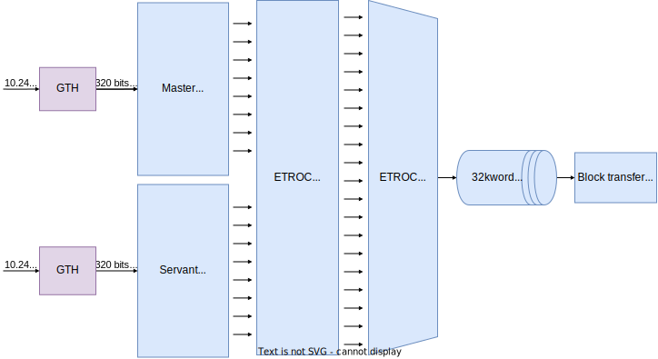
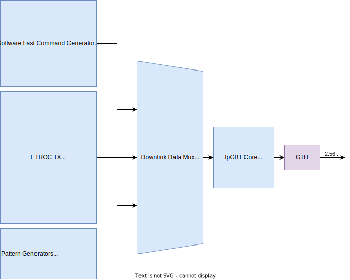
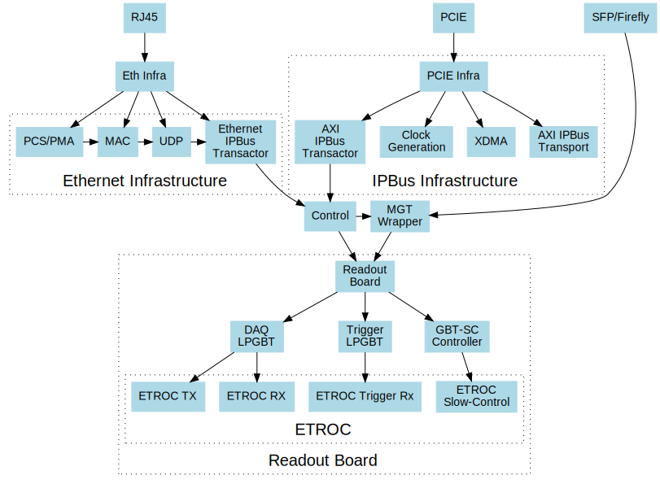
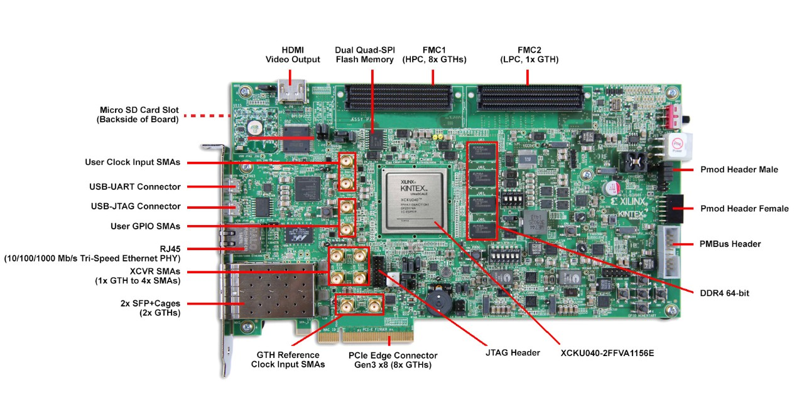

## Table of Contents <span class="tag" data-tag-name="TOC_4"><span class="smallcaps">TOC\_4</span></span>

  - [Changelog](#changelog)
      - [v1.3.3](#v133)
      - [v1.3.2](#v132)
      - [v1.3.1](#v131)
      - [v1.2.10](#v1210)
      - [v1.2.7](#v127)
  - [Build Instructions](#build-instructions)
  - [Directories](#directories)
  - [Updating Register Definitions](#updating-register-definitions)
  - [Block Diagram](#block-diagram)
      - [DAQ](#daq)
      - [Downlink](#downlink)
      - [Firmware Infrastructure](#firmware-infrastructure)
  - [Optical Connections](#optical-connections)
  - [Hardware Setup](#hardware-setup)
      - [XDMA](#xdma)
      - [Ethernet](#ethernet)

## Changelog

This changelog describes changes made in recommended versions of the
firmware. Versions not described here are intermediate versions which
are either not tested or known to be problematic. Change log is
inclusive of all changes from the previous recommended version; please
only use the versions listed here unless instructed otherwise.

### v1.3.3

  - Fix an issue with the ETROC decoder getting stuck in the locked
    state
  - Add a "raw data mode" to the ETROC decoder which simply writes the
    raw 40 bit frames
  - Separate the bitslip/reset/zero suppress/raw data mode between
    master and slave
  - Add an external trigger output (mirror of the internal L1A signal)

### v1.3.2

  - Add a feature to disable automatic bitslipping in the ETROC decoder
    (for debug purposes)
  - Start and end of packet signals should now only be 1bx wide (instead
    of 5)

### v1.3.1

  - Improve timing closure by various tweaks which should not affect
    functionality
  - Purge Si570 clock mirror output (was used during testing)
  - Hopefully improve reliability of UDP transactions w/ more timing
    constraints
  - Update docs
  - Upgrade to vivado 2021.1

### v1.2.10

  - Support for LPGBT version 1
  - Fix lpgbt fifo reset signal which was not connected
  - Increase the number of xpm stages to improve timing
  - Add ETROC error counters
  - ILA improvements
  - Upgrade submodules

### v1.2.7

  - Add received packet counters
  - Add an ETROC rx locked signal
  - Add a packet rate counter
  - Add per-etroc packet decoders and mux their outputs, to have
    counters run in parallel
  - Add device DNA readout
  - Add SFP disable to firmware control
  - Improvements to program.sh

## Build Instructions

To build the firmware, simply clone the repository and run:

    make init
    make impl

## Directories

    ├── README.org     -- This readme
    ├── Makefile       -- GNU Makefile
    ├── readout_board  -- Readout Board Firmware
    ├── etroc          -- ETROC Firmware
    ├── wrappers       -- Wrappers around IP/Submodules
    ├── xdc            -- XDC Constraints Files
    ├── doc            -- Documentation & Images
    ├── ip             -- Xilinx IP
    ├── lpgbt-fpga     -- Submodule: LPGBT-FPGA Core
    ├── gbt-sc         -- Submodule: CERN GBT-SC Core
    ├── ipbus-firmware -- Submodule: IPBus Firmware
    ├── Top            -- Hog Projects
    └── Hog            -- Hog Build System

## Updating Register Definitions

To update register definitions, you should change the corresponding XML
file and then run

    make reg

## Block Diagram

### DAQ



### Downlink



### Firmware Infrastructure



## Optical Connections

| Function       | Fiber Number  |
| -------------- | ------------- |
| Downlink       | RX (Fiber 7)  |
| DAQ Uplink     | TX1 (Fiber 6) |
| Trigger Uplink | TX2 (Fiber 5) |

## Hardware Setup

Details of the hardware setup and a shopping list can be read at
[shopping](http://etl-rb.web.cern.ch/Setup/test-stand-shopping/).

### XDMA

We are using the Xilinx PCIE XDMA driver for register access to the
KCU105 board. It is configured for 8 GT/s, 1 lane PCIE (we can expand
the number of lanes in the future if needed).

Details of the XDMA setup and installationcan be read at
[XDMA](doc/XDMA.org).

### Ethernet

A gigabit ethernet port may also be used for control.

The ethernet interface on your computer can be configured, e.g. with the
command:

``` bash
sudo /sbin/ifconfig eth0 192.168.0.130 netmask 255.255.255.0 broadcast 192.168.0.255
```


