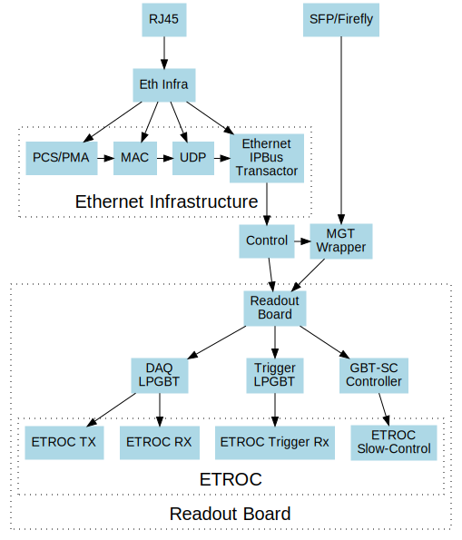

# Table of Contents

1.  [ETL Test Stand Firmware](#ETL%20Test%20Stand%20Firmware)
    1.  [Changelog](#Changelog)
        1.  [v1.3.1](#v1.3.1)
        2.  [v1.2.10](#v1.2.10)
        3.  [v1.2.7](#v1.2.7)
    2.  [Build Instructions](#Build%20Instructions)
    3.  [Directories](#Directories)
    4.  [Updating Register Definitions](#Updating%20Register%20Definitions)
    5.  [Block Diagram](#Block%20Diagram)
        1.  [DAQ](#DAQ)
        2.  [Downlink](#Downlink)
        3.  [Firmware Infrastructure](#Firmware%20Infrastructure)
    6.  [Optical Connections](#Optical%20Connections)
    7.  [Hardware Setup](#Hardware%20Setup)
        1.  [XDMA](#XDMA)
        2.  [Ethernet](#Ethernet)

# ETL Test Stand Firmware

## Changelog

This changelog describes changes made in recommended versions of the firmware.
Versions not described here are intermediate versions which are either not tested or known to be problematic.
Change log is inclusive of all changes from the previous recommended version; please only use the versions listed here unless instructed otherwise.

### v1.3.1

-   Improve timing closure by various tweaks which should not affect functionality
-   Purge Si570 clock mirror output (was used during testing)
-   Hopefully improve reliability of UDP transactions w/ more timing constraints
-   Update docs
-   Upgrade to vivado 2021.1

### v1.2.10

-   Support for LPGBT version 1
-   Fix lpgbt fifo reset signal which was not connected
-   Increase the number of xpm stages to improve timing
-   Add ETROC error counters
-   ILA improvements
-   Upgrade submodules

### v1.2.7

-   Add received packet counters
-   Add an ETROC rx locked signal
-   Add a packet rate counter
-   Add per-etroc packet decoders and mux their outputs, to have counters run in parallel
-   Add device DNA readout
-   Add SFP disable to firmware control
-   Improvements to program.sh

## Build Instructions

To build the firmware, simply clone the repository and run:

    make init
    make impl

## Directories

    ├── README.org     -- This readme
    ├── Makefile       -- GNU Makefile
    ├── readout_board  -- Readout Board Firmware
    ├── etroc          -- ETROC Firmware
    ├── wrappers       -- Wrappers around IP/Submodules
    ├── xdc            -- XDC Constraints Files
    ├── doc            -- Documentation & Images
    ├── ip             -- Xilinx IP
    ├── lpgbt-fpga     -- Submodule: LPGBT-FPGA Core
    ├── gbt-sc         -- Submodule: CERN GBT-SC Core
    ├── ipbus-firmware -- Submodule: IPBus Firmware
    ├── Top            -- Hog Projects
    └── Hog            -- Hog Build System

## Updating Register Definitions

To update register definitions, you should change the corresponding XML file and then run

    make reg

## Block Diagram

### DAQ

### Downlink

### Firmware Infrastructure

## Optical Connections

<table border="2" cellspacing="0" cellpadding="6" rules="groups" frame="hsides">

<colgroup>
<col  class="org-left" />

<col  class="org-left" />
</colgroup>
<thead>
<tr>
<th scope="col" class="org-left">Function</th>
<th scope="col" class="org-left">Fiber Number</th>
</tr>
</thead>

<tbody>
<tr>
<td class="org-left">Downlink</td>
<td class="org-left">RX (Fiber 7)</td>
</tr>

<tr>
<td class="org-left">DAQ Uplink</td>
<td class="org-left">TX1 (Fiber 6)</td>
</tr>

<tr>
<td class="org-left">Trigger Uplink</td>
<td class="org-left">TX2 (Fiber 5)</td>
</tr>
</tbody>
</table>

## Hardware Setup

Details of the hardware setup and a shopping list can be read at [shopping](http://etl-rb.web.cern.ch/Setup/test-stand-shopping/).

### XDMA

We are using the Xilinx PCIE XDMA driver for register access to the KCU105 board. It is configured
for 8 GT/s, 1 lane PCIE (we can expand the number of lanes in the future if needed).

Details of the XDMA setup and installationcan be read at  [XDMA](doc/XDMA.md).

### Ethernet

A gigabit ethernet port may also be used for control.

The ethernet interface on your computer can be configured, e.g. with the command:

    sudo /sbin/ifconfig eth0 192.168.0.130 netmask 255.255.255.0 broadcast 192.168.0.255

